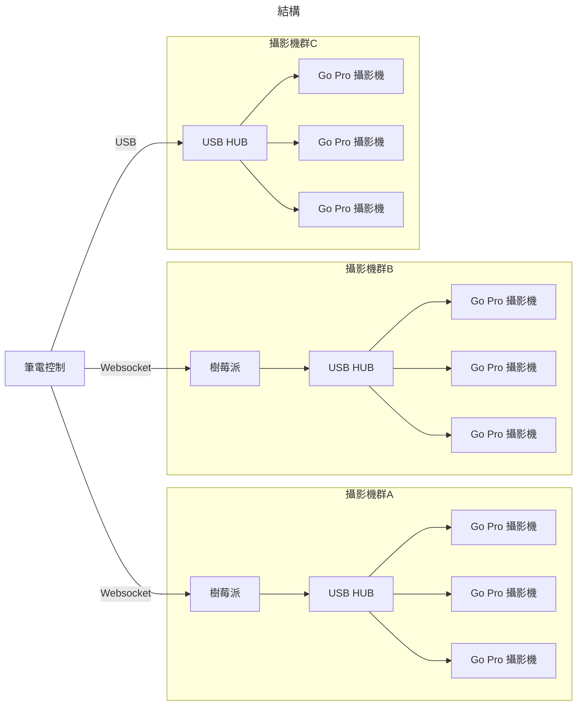

# GoPro Controller

這是一個透過 GUI 控制 GoPro 的專案

## 開發需求

* Debine OS / Windows OS
* CMake
```bash
sudo apt update
sudo apt install cmake
```
* ARM64 C++編譯器
可以透過以下指令下載
```bash
sudo apt update
sudo apt install g++-aarch64-linux-gnu
```

總共有兩個輸出的應用程式
* Master
    * AMD64 (WIN/LINUX)
* Server
    * ARM64 (LINUX)

#### Master

附有 UI 介面的控制器, 可以透過這個介面跟其他 Websocket 或是 Go-Pro 直接連結.

#### Server

Websocket, Go-Pro 的中繼站, 會把訊息轉發到 Master.

## 架構圖



## Raspberry 建構

需要在 Repo Root 開啟 http-server 建議工具: [http-server](https://www.npmjs.com/package/http-server)

```bash
# 在 Repo 本地開啟
http-server -p 8080
```

接著開啟另一個 Terminal

```bash
```

## 協定

可以參考 GoPro Http API 協定的 [Docs](https://gopro.github.io/OpenGoPro/http#tag/Webcam/operation/GPCAMERA_WEBCAM_START_OGP)

透過 {IP}:9090/ 進入 websocket server

接著透過這個方式傳輸訊息, websocket server 會有 analysis header 的 key, 把訊息丟到對的 processer.
```json
{
    "key": "string",
    "value": "object"
}
```

#### KEY: command

抓到所有狀態

需求物件結構
```json
{
    "name": "label",
    "target": "IP target"
}
```

回傳物件結構
```json
{
    "name": "coming label",
    "message": "message"
}
```

##### name: reboot

對象 GoPro 重開機

##### name: shutdown

對象 GoPro 關機

##### name: keep_alive

重新啟動對象 GoPro USB 睡眠倒數

##### name: usb_on

開啟對象 GoPro USB 控制模式

##### name: usb_off

關閉對象 GoPro USB 控制模式

##### name: datetime

改變日期時間

##### name: zoom

##### name: shutter

##### name: ip

這項指令會回傳 ip

```json
{
    "data": [
        "IP.A", "IP.B"
    ]
}
```

#### KEY: query

抓到所有狀態

需求物件結構
```json
{
    "name": "label",
    "mode": "all | single",
    "target": "IP target",
}
```

回傳物件結構
```json
{

}
```

#### KEY: webcam

網路攝影機方面的動作

需求物件結構
```json
{
    "name": "label",
    "mode": "all | single",
    "target": "IP target"
}
```

回傳物件結構
```json
{

}
```