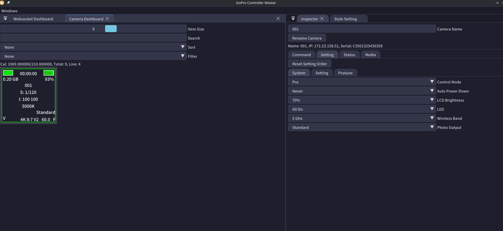
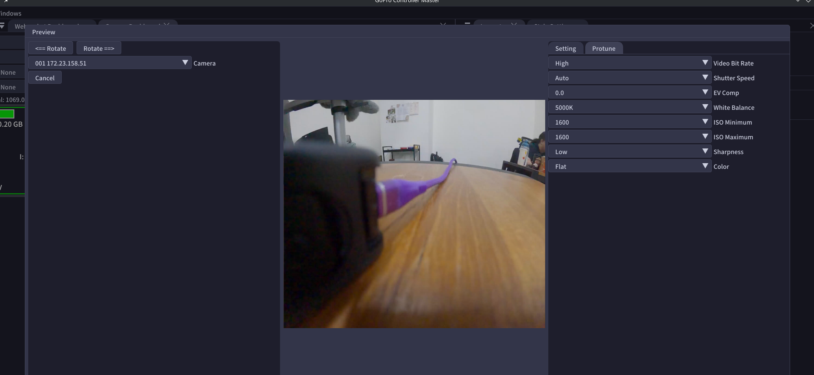
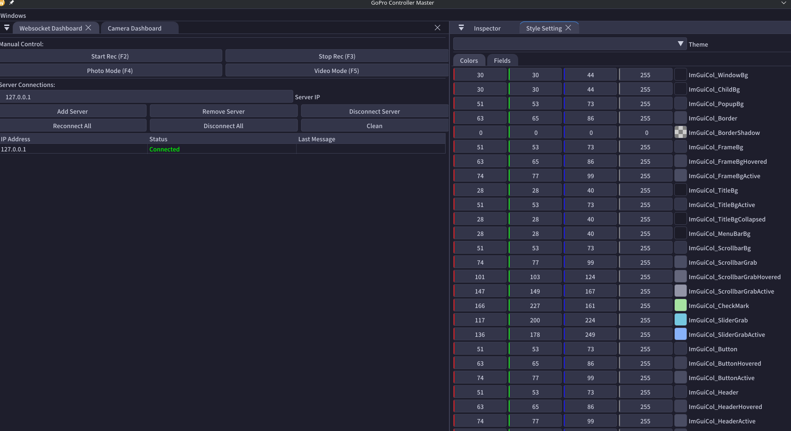

# GoPro Controller

Tool for control multiple GoPro Cameras, The design is for above 100 cameras connection.

[Wiki](https://github.com/Elly2018/GoPro_Controller/wiki)

## Application Requirement

* Operating System: Debine / Windows

## Screenshot

## Protocol

* [Open GoPro Docs](https://gopro.github.io/OpenGoPro/http#tag/Webcam/operation/GPCAMERA_WEBCAM_START_OGP)
* [gpControl Hack](https://github.com/KonradIT/goprowifihack/blob/master/HERO11/HERO11-Commands.md)

