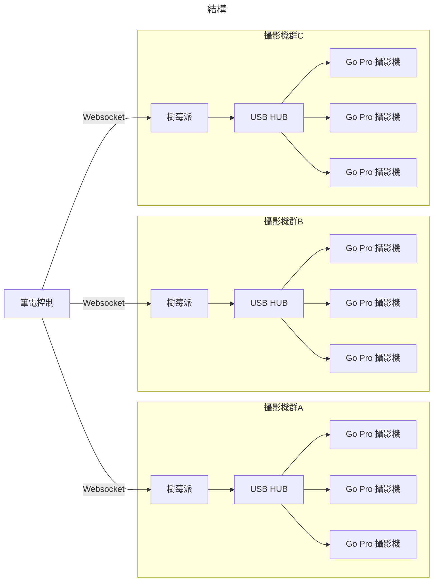

# GoPro Controller

這是一個透過 GUI 控制 GoPro 的專案

## 架構圖



```mermaid
---
title: 建置流程, 包含機器
---
```

## 協定

透過 {IP}:3000/api 進入 websocket server

接著透過這個方式傳輸訊息, websocket server 會有 analysis header 的 key, 把訊息丟到對的 processer.
```json
{
    "key": "string",
    "value": "object"
}
```

#### KEY: fetch

抓到所有狀態

需求物件結構
```json
{}
```

回傳物件結構
```json
{
    "cameras": [
        {
            "serial": "string"
        }
    ]
}
```

#### KEY: command

抓到所有狀態

需求物件結構
```json
{
    "name": [
        "keep_alive", "", ""
    ]
}
```

回傳物件結構
```json
{

}
```