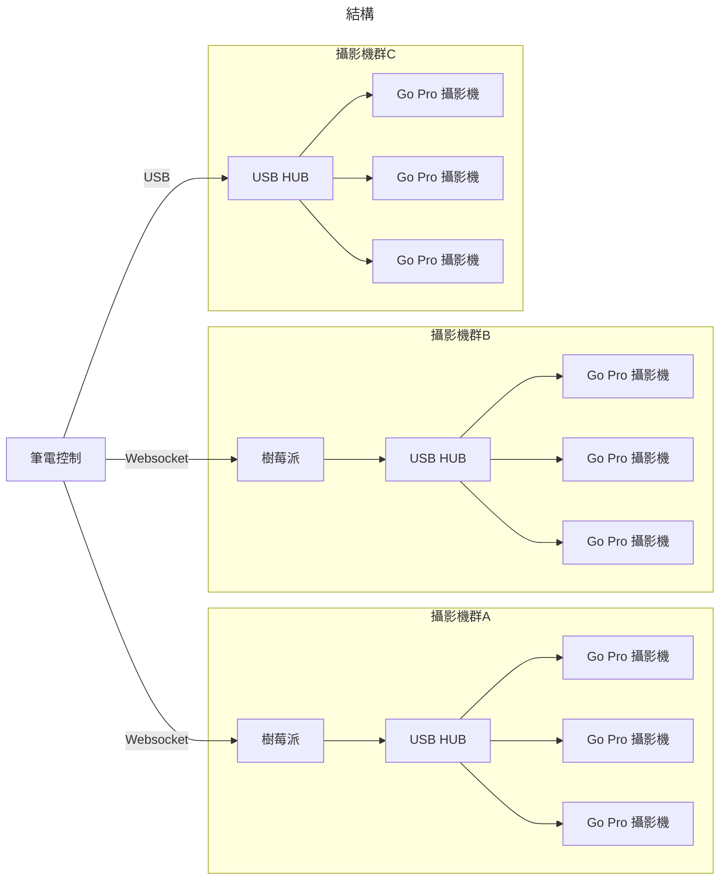
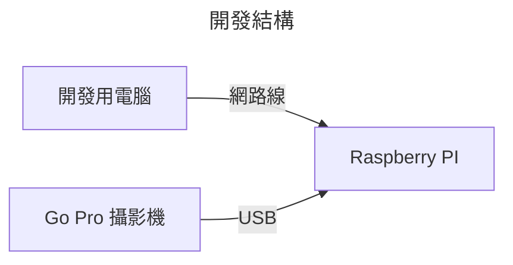
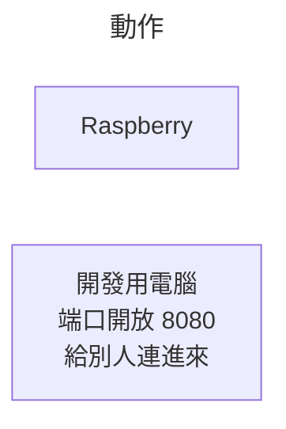
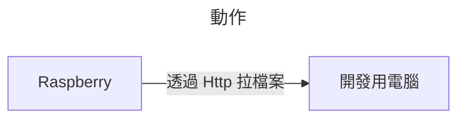
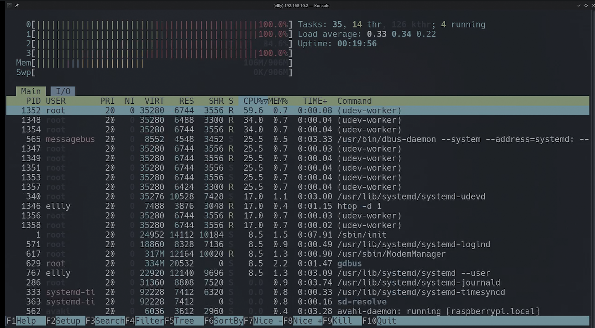
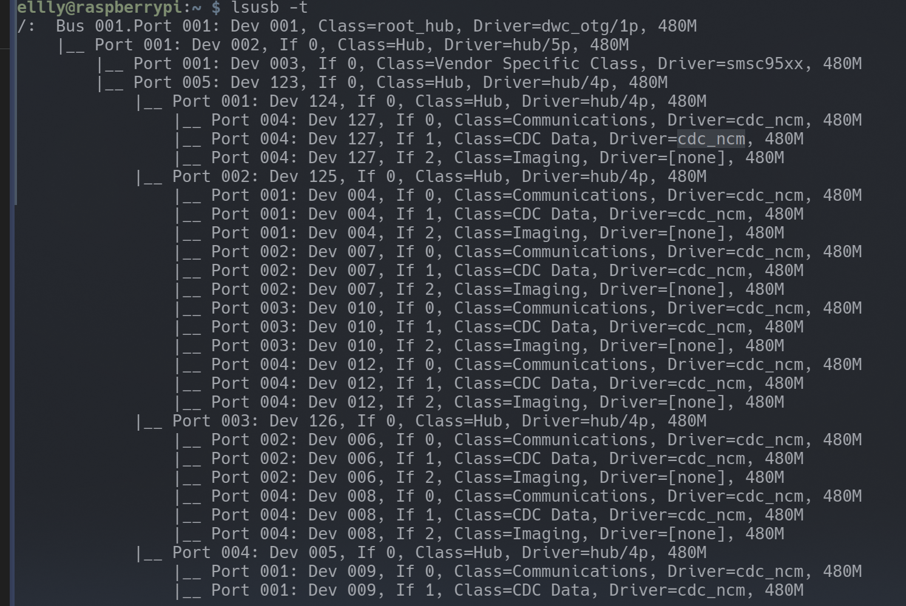
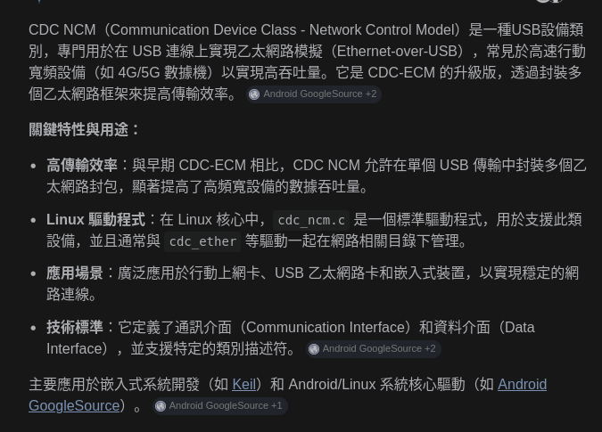

# GoPro Controller

這是一個透過 GUI 控制 GoPro 的專案

## 開發需求

* Debine OS / Windows OS

### Debine 需要配置

* CMake
```bash
sudo apt update
sudo apt install cmake
```
* ARM64 C++編譯器
可以透過以下指令下載
```bash
sudo apt update
sudo apt install g++-aarch64-linux-gnu
```
* Master 解碼器, OpenCV 會用到 ffmpeg, Linux 需要以下的庫
```bash
sudo apt-get update
sudo apt-get install libopencv-dev libavcodec-dev libavformat-dev libswscale-dev libavutil-dev
sudo apt-get install gstreamer1.0-plugins-bad gstreamer1.0-plugins-ugly
```

### Windows 需要配置

* [7Z](https://www.7-zip.org/)
* [CMake](https://cmake.org/)
* [MSVC](https://visualstudio.microsoft.com/vs/features/cplusplus/)
  * 再建置的時候你要去 VS 改成 C++ Standard 17, 否則不會建置成功...

總共有兩個輸出的應用程式
* Master
    * AMD64 (WIN/LINUX)
* Server
    * ARM64 (LINUX)

#### Master

附有 UI 介面的控制器, 可以透過這個介面跟其他 Websocket 或是 Go-Pro 直接連結.

#### Server

Websocket, Go-Pro 的中繼站, 會把訊息轉發到 Master.

## 架構圖

Raspberry pi 用於負載分散, 如果性能不夠也可以改用 mini pc 或是 desktop pc 承擔



## Raspberry 建構



#### IP Setup

通常希望開發的機器使用
* 192.168.10.10, gw 192.168.10.1, netmask 255.255.255.0

PI 則是 
* 192.168.10.(2-9), gw 192.168.10.1, netmask 255.255.255.0

這個就是為了方便而已, 當然你可以改你自己喜歡的 IP 結構.

```bash
# SSH 進去你的 PI
# 介面化 PI 網路管理
sudo nmtui
```

#### 安裝程式

需要在 Repo Root 開啟 http-server 建議工具: [http-server](https://www.npmjs.com/package/http-server)

```bash
# 在 Repo 本地開啟
http-server -p 8080
```



接著開啟另一個 Terminal

```bash
# SSH 到你的 PI
sudo systemctl stop startup.service
sudo curl http://192.168.10.10:8080/build_server/server -o /usr/local/bin/server
sudo systemctl start startup.service
sudo systemctl status startup.service
```



用 ldd 查看依賴性

```bash
ldd server
# Output:
#   linux-vdso.so.1 (0x0000007fb8ded000)
#   libhv.so => /lib/libhv.so (0x0000007fb8a50000) 這一行 !!
#   libstdc++.so.6 => /lib/aarch64-linux-gnu/libstdc++.so.6 (0x0000007fb87e0000)
#   libgcc_s.so.1 => /lib/aarch64-linux-gnu/libgcc_s.so.1 (0x0000007fb87a0000)
#   libc.so.6 => /lib/aarch64-linux-gnu/libc.so.6 (0x0000007fb85e0000)
#   /lib/ld-linux-aarch64.so.1 (0x0000007fb8da0000)
#   libm.so.6 => /lib/aarch64-linux-gnu/libm.so.6 (0x0000007fb8530000)
```

你會看到 libhv.so 依賴於 /lib 資料夾, 如果還沒有安裝依賴庫

```bash
# 快速解決依賴問題
sudo curl http://192.168.10.10:8080/build_server/lib/libhv.so -o /lib/libhv.so
sudo curl http://192.168.10.10:8080/build_server/_deps/curl-build/lib/libcurl-d.so.4 -o /lib/libcurl-d.so.4
sudo curl http://192.168.10.10:8080/build_server/_deps/curl-build/lib/libcurl-d.so -o /lib/libcurl-d.so
```

#### 開機自動執行

弄一個 Bash script
```bash
sudo nano /usr/local/bin/startup.sh
```

打上啟動程式的腳本

下面這一大串就是為了一開機就可以把程式 run 起來的設定.

```bash
#!/bin/bash
cd /home/ellly
# 讓我們的程序 只跑在 CPU 3
taskset -c 3 /usr/local/bin/server
```

建議一個 Service 在 /lib/system/lib/systemd/system/startup.service
```bash
sudo nano /lib/systemd/system/startup.service
```

```bash
[Unit]
Description=My Websocket Server
After=network.target

[Service]
ExecStart=/usr/local/bin/startup.sh
Restart=on-failure
RestartSec=2s

[Install]
WantedBy=multi-user.target
```

重製 systemd
```bash
sudo chmod +x /usr/local/bin/startup.sh
sudo systemctl daemon-reload
sudo systemctl enable startup.service
sudo systemctl start startup.service

# 用這一行看執行 log
sudo systemctl status startup.service

# 用這一行重啟動
sudo systemctl restart startup.service
```

### Hardware 探索問題



當樹莓派直接連結到 USB HUB, 會產生 udev worker 無限的去抓 hardware...\
這些執行序會燒光你的 CPU 資源.\
我們必須去透過設定, 讓 udev 最高執行序被設定 (預設是沒有上限)

```bash
# 編輯 udev config
sudo nano /etc/udev/udev.conf
```

```bash
# 給它 2 個子執行序上限
udev_children_max=2
```

```bash
# 重開服務
sudo systemctl restart systemd-udevd
```

確保 SSH 不會卡

```bash
sudo nano /etc/ssh/sshd_config
```

加這一行

```bash
IPQoS throughput lowdelay
```

然後重開 ssh 服務

```bash
sudo systemctl restart ssh
```

讓 udev 跑在 0, 1, 2 執行序

```bash
sudo taskset -p -a 7 $(pidof systemd-udevd)
```

在 /boot/firmware/cmdline.txt 加上這幾個

```bash
sudo nano /boot/cmdline.txt
```

```bash
dwc_otg.fiq_fix_enable=1 dwc_otg.fiq_fsm_enable=1 dwc_otg.nak_holdoff=1,isolcpus=3
```

* fiq_fix_enable=1
    * USB 加速, CPU 優化性能
* fiq_fsm_enable=1
    * Kernal 排序上的優化
* nak_holdoff=1
    * 如果沒資料, 不會主動 request, CPU 優化
* isolcpus=3
    * 隔離 CPU 核心 3

之所以需要以上的設定是因為這個 

這個是連結 Hub 的時候


這個是網路上對於 cdc_ncm 協定的解釋


每個 Go Pro USB 連結, 建立 3 個協定. 所以才灌爆 Kernal...\
上面做的事情基本上就是, 我的程式要跑在 CPU 3, 其他 USB 什麼鬼的給我去 CPU 1, 2, 3

## 協定

可以參考 GoPro Http API 協定的 [Docs](https://gopro.github.io/OpenGoPro/http#tag/Webcam/operation/GPCAMERA_WEBCAM_START_OGP)

你的 GoPro 必須要用 USB 連著 (沒錯, GoPro 可以用 Http 控制, 當用 USB 接著)

透過 {IP}:9090/ 進入 websocket server

接著透過這個方式傳輸訊息, websocket server 會有 analysis header 的 key, 把訊息丟到對的 processer.

需求物件結構
```json
{
    "key": "command | query | webcam | media | preview | preset",
    "value": {
        "name": "label"
    }
}
```
需求樹狀圖

* key: command
  * value-name: reboot
  * value-name: shutdown
  * value-name: keep_alive
  * value-name: usb_on
  * value-name: usb_off
  * value-name: datetime
  * value-name: zoom
  * value-name: shutter_on
  * value-name: shutter_off
  * value-name: ip
  * value-name: scan
  * value-name: clean
  * value-name: add
  * value-name: delete
  * value-name: rename
* key: query
  * value-name: get
  * value-name: getall
  * value-name: set
  * value-name: setall
* key: webcam
  * value-name: preview
  * value-name: exit
  * value-name: start
  * value-name: stop
  * value-name: status
  * value-name: version
* key: media
  * value-name: lastmedia
* key: preview
  * value-name: start
  * value-name: stop
* key: preset
  * value-name: set
