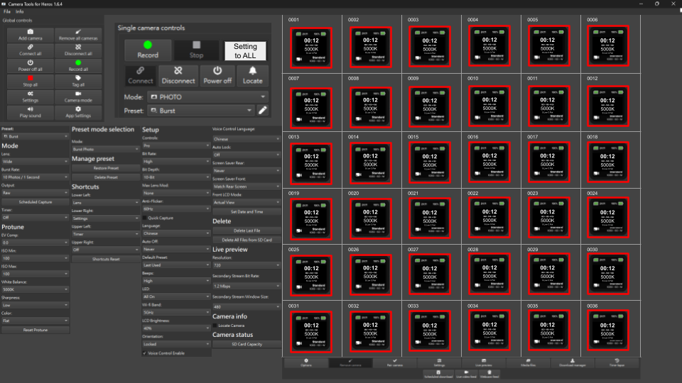

# GoPro development plan

## Goal

This is the application control multiple go-pro cameras. (Up to 36 cameras)

## Reference

We want UI will looks like this:

You can find http control meThods in here: https://gopro.github.io/OpenGoPro/http#tag/settings/operation/GPCAMERA_CHANGE_SETTING::178

We're using USB to control go-pro, not the WIFI

## 1. Hotkey

We want to use hotkey to control the go-pro, the hotkey will be like this:

* F2
    * All connected go-pro cameras will start recording
* F3
    * All connected go-pro cameras will stop recording
* F4
    * All connected go-pro cameras will switch photo mode
* F5
    * All connected go-pro cameras will switch video mode

## 2. Project Details

We are acutally need 2 application output, Why ? Let me explain

We have 36 go-pro cameras, And 3 Hubs to connect all of them, But if we connect every go-pro to a single computer, it will be too slow, and it's bug out. So we figure out that we needs 3 raspberry pi with a websocket server on. And the computer use WIFI to connect to rasberry pi websocket server to monitor or modify the state of the go-pro cameras.

So the two application file output will be
* server.exe
    * This will install in the raspberry pi
    * This application does not need a UI interface. just pure USB control and websocket server.
* master.exe
    * This will install in the computer
    * This application need a UI interface. I want to use imgui for UI, opencv for video stream preview.

## 3. Structure

The folder structures

* src (All the source code goes here)
* lib (ALl downloaded library goes here)
* bin (Output file goes here)

And i need to use CMake to structure, Because that's what i'm familiar with.